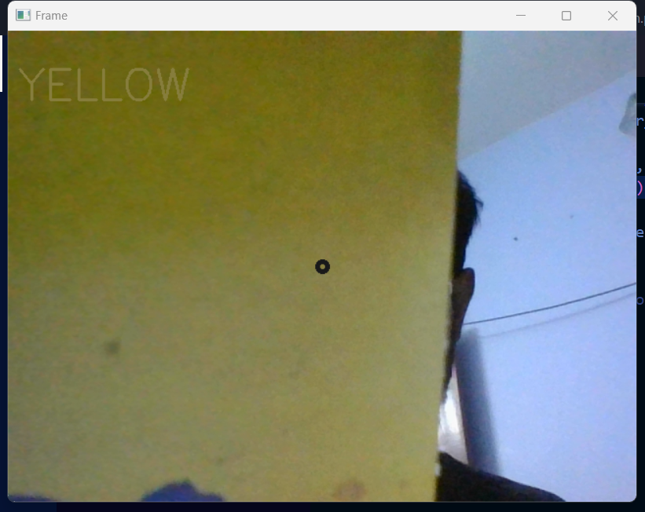
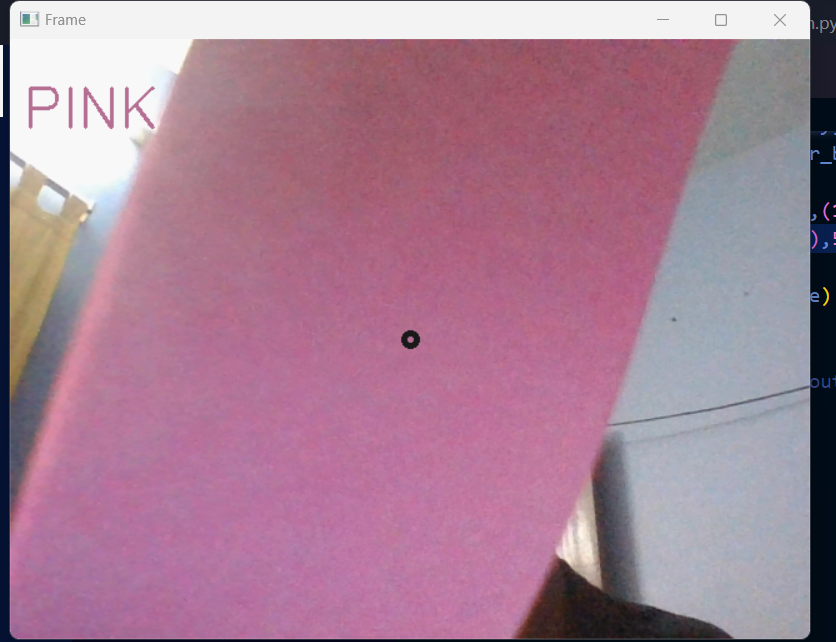

# Color Detection
 This project uses WebCam and tries to detect the color of the object in the center of the frame at a given instance

Requirements :

* python 3.10
* opencv
* numpy


```pip install opencv-python```

```pip install numpy```

Here are a few demo images of the project :

<br>

